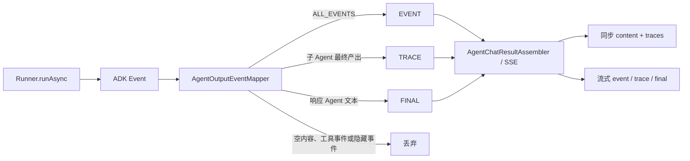

# 并行 Agent 输出策略设计与实现记录

## 1. 文档目的

本文面向项目维护开发者，记录并行调研工作流输出问题的现象、根因、方案取舍、实现过程、事件协议、测试证据和兼容性约束。

本文所说的 `TRACE` 是子 Agent 对外提交的最终调研产出，不是模型隐藏思维链，也不承诺提供或还原模型内部推理过程。

## 2. 问题背景

`parallel_research_app.yml` 使用顺序工作流包装并行调研：

1. `ParallelResearchAgent` 同时运行三个 Researcher。
2. `SynthesisAgent` 汇总三个调研结果。
3. `ResearchAndSynthesisPipeline` 负责串联以上两个阶段。

工作流编排本身符合预期，但原 HTTP 响应会依次显示三个 Researcher 的输出，最后再显示一次 `SynthesisAgent` 的汇总。用户看到的是多段结果直接叠加，而不是一份以最终汇总为主、过程信息可选展开的回答。

## 3. 原实现与根因

原 `ChatService` 直接消费 ADK Runner 返回的所有 `Event`：

```java
events.blockingForEach(event -> outputs.add(event.stringifyContent()));
```

原 `AgentServiceController` 再将所有字符串拼接为一个正文：

```java
responseDTO.setContent(String.join("\n", messages));
```

ADK 的 `Event` 是执行事件，不等同于用户响应。事件中可能包含：

- 子 Agent 的最终调研结果；
- 最终 Agent 的中间输出和最终输出；
- 工具调用与工具响应；
- 其他具有内容的执行事件。

因此，问题不在并行 Agent 编排，而在输出层缺少以下语义：

- 哪个 Agent 负责最终回答；
- 哪些内容是可选调研轨迹；
- 哪些事件只用于兼容旧行为；
- 哪些工具事件不应直接展示。

## 4. 设计目标与非目标

### 4.1 目标

- 明确指定最终响应 Agent，避免依赖事件顺序猜测最终答案。
- 同步接口将最终答案和调研轨迹分开返回。
- 流式接口通过结构化 SSE 表达事件类型和作者。
- 支持只返回最终答案、最终答案附带轨迹以及旧行为兼容三种策略。
- 在 Agent 装配阶段发现非法输出配置。
- 客户端断开流式连接时停止后端订阅。
- 旧 Agent 未配置新字段时继续按原方式输出。

### 4.2 非目标

- 不改变 Parallel、Sequential Agent 的执行顺序或并发模型。
- 不展示模型隐藏思维链。
- 不对 Researcher 输出做新的内容摘要或二次脱敏。
- 不在本次改动中实现前端折叠面板。

## 5. 方案取舍

### 5.1 方案 A：Controller 只取最后一条字符串

优点是改动少。缺点是最后一个事件不一定来自最终 Agent，也可能是工具响应或其他生命周期事件；事件顺序变化会直接破坏接口语义，因此未采用。

### 5.2 方案 B：提示词要求子 Agent 不输出

提示词只能影响模型生成，不能阻止 ADK 产生和上送执行事件，也不能提供稳定的接口契约，因此未采用。

### 5.3 方案 C：显式响应 Agent + 类型化输出事件

通过 `response-agent-name` 指定最终响应者，通过输出策略决定非响应 Agent 的可见性，并在领域层将 ADK `Event` 映射为项目自己的 `EVENT`、`TRACE`、`FINAL`。该方案职责清晰，能够同时服务同步和流式接口，因此采用。

## 6. 输出策略

Runner 支持以下模式：

| 配置值 | 子 Agent 输出 | 最终响应 Agent 输出 | 用途 |
| --- | --- | --- | --- |
| `ALL_EVENTS` | 作为 `EVENT` 保留 | 作为 `EVENT` 保留 | 兼容旧 Agent 行为 |
| `FINAL_ONLY` | 隐藏 | 作为 `FINAL` 返回 | 只展示最终答案 |
| `FINAL_WITH_TRACE` | 仅最终响应作为 `TRACE` 保留 | 作为 `FINAL` 返回 | 最终答案附带可选调研轨迹 |

当前并行调研配置为：

```yaml
runner:
  agent-name: ResearchAndSynthesisPipeline
  response-agent-name: SynthesisAgent
  output-mode: FINAL_WITH_TRACE
```

`agent-name` 指定执行整个工作流的根 Agent，`response-agent-name` 指定最终回答用户的 Agent，两者职责不同。

## 7. 配置字符串与运行时枚举边界

输出模式采用“外部字符串、内部枚举”的设计：

```text
YAML String
    -> AiAgentConfigTableVO.Runner
    -> AgentOutputPolicyValidator 解析、校验、规范化
    -> OutputModeEnum
    -> AiAgentRegisterVO
    -> AgentOutputEventMapper
```

### 7.1 为什么 YAML 层保留 String

- 保持现有 YAML 结构和字段值不变。
- 可以为非法配置提供项目自己的 `AppException` 和明确错误信息。
- 可以接受大小写差异和首尾空白，并规范化为标准代码。
- 避免将配置绑定器的枚举转换规则变成隐式接口约束。

### 7.2 为什么运行时改用 OutputModeEnum

- 消除 Validator、Mapper 和默认配置中的重复魔法字符串。
- 避免字符串拼写错误导致分支失效。
- 保证注册完成后的 Agent 只能持有已验证的输出模式。
- 后续新增模式时由枚举提供唯一事实来源。

`OutputModeEnum.fromCode` 支持忽略大小写和首尾空白；空值和未知值返回空结果，由 Validator 决定默认或抛出业务异常。

## 8. 事件模型与映射规则

领域事件 `AgentOutputEventVO` 包含：

```java
Type type;
String agentName;
String content;
boolean completed;
```

事件类型语义：

- `EVENT`：`ALL_EVENTS` 兼容模式下的原始可见事件。
- `TRACE`：非响应 Agent 已完成的最终调研产出。
- `FINAL`：配置指定的响应 Agent 产生的用户答案事件。

`AgentOutputEventMapper` 的映射顺序如下：

1. 空内容事件直接忽略。
2. 输出模式为空或为 `ALL_EVENTS` 时映射为 `EVENT`。
3. 事件作者等于 `response-agent-name` 时进入最终响应分支。
4. 响应 Agent 的函数调用和函数响应被过滤，避免误标为最终答案。
5. 响应 Agent 的文本事件映射为 `FINAL`，并保留 `completed` 状态供流式消费。
6. `FINAL_WITH_TRACE` 下，非响应 Agent 只有 `finalResponse()` 事件映射为 `TRACE`。
7. `FINAL_ONLY` 下，非响应 Agent 事件全部隐藏。

需要保留响应 Agent 的未完成 `FINAL` 事件，是为了支持流式展示；同步汇总时只选择 `completed=true` 的 `FINAL`，避免把中间片段重复拼入最终正文。

## 9. 完整数据流



## 10. 分层实现记录

### 10.1 配置与运行时模型

- `AiAgentConfigTableVO.Runner` 新增 `responseAgentName` 和字符串 `outputMode`，默认值来自 `OutputModeEnum.ALL_EVENTS.getCode()`。
- `AiAgentRegisterVO` 保存 `responseAgentName` 和已经验证的 `OutputModeEnum`。
- `OutputModeEnum` 定义标准代码、维护者描述和 `fromCode` 解析方法。

### 10.2 装配层

- `AgentOutputPolicyValidator` 校验输出模式是否合法。
- 空模式被规范化为 `ALL_EVENTS`。
- `FINAL_ONLY` 和 `FINAL_WITH_TRACE` 必须配置存在于当前 Agent 集合中的响应 Agent。
- Validator 返回解析后的枚举，`RunnerNode` 将其写入运行时注册对象。

### 10.3 领域服务层

- `AgentOutputEventMapper` 将框架事件转换成项目领域事件。
- `ChatService` 的同步和流式入口共用 `runEvents`，避免两套分类规则漂移。
- `AgentChatResultAssembler` 将已完成的 `FINAL` 汇总为 `content`，将 `TRACE` 单独汇总为 `traces`。
- `ALL_EVENTS` 模式继续把所有 `EVENT` 内容拼接到同步 `content`，保持旧行为。

### 10.4 API 与 Trigger 层

- `ChatResponseDTO` 增加 `traces`，每条轨迹包含 Agent 名称、内容和完成状态。
- `/chat` 不再对所有子 Agent 输出做无差别换行拼接。
- `/chat_stream` 使用 `SseEmitter` 和 `text/event-stream`，事件名为小写 `event`、`trace` 或 `final`，数据为 JSON。
- `AgentStreamSubscription` 在完成、超时、断连、发送失败和执行异常时释放 RxJava `Disposable`。

## 11. 接口结果

### 11.1 同步接口

`FINAL_WITH_TRACE` 的业务数据结构示例：

```json
{
  "content": "SynthesisAgent 生成的最终汇总",
  "traces": [
    {
      "agentName": "EVResearcher",
      "content": "电动汽车调研结果",
      "completed": true
    }
  ]
}
```

前端只读取 `content` 时只展示最终答案；需要展示过程时，再将 `traces` 渲染为可折叠调研轨迹。

### 11.2 流式接口

SSE 示例：

```text
event: trace
data: {"type":"TRACE","agentName":"EVResearcher","content":"...","completed":true}

event: final
data: {"type":"FINAL","agentName":"SynthesisAgent","content":"...","completed":true}
```

这是对旧裸文本流协议的结构化升级，流式客户端需要按 SSE 事件名称和 JSON 数据解析。

### 11.3 前端流式消费

静态前端使用原生 `fetch` POST `/chat_stream`，而不是浏览器 `EventSource`。原因是 `EventSource` 只支持 GET，无法直接携带当前聊天接口需要的 JSON 请求体。

前端流式链路为：

```text
fetch POST /chat_stream
  -> ReadableStream + TextDecoder
  -> createSseParser
  -> createAgentStreamState
     -> trace: 按 agentName 更新默认收起的调研区域
     -> final/event: 合并并更新同一个最终答案区域
```

`sse-client.js` 是无 DOM 的协议模块，负责响应类型校验、跨网络块分帧、多行 `data` 合并、JSON 解码、累计/增量文本去重以及错误时取消响应流。`index.js` 负责发起请求、管理 `AbortController` 和 DOM 渲染。

前端通过 `AbortController` 保存活动请求。切换 Agent、退出登录、页面卸载以及新请求开始前都会取消旧流；主动取消不显示为服务端异常。流正常结束但没有收到 `final` 或兼容 `event` 时，已有 trace 被保留，同时显示缺少最终内容的错误。

## 12. 配置错误处理

以下配置在 Agent 装配阶段失败：

- `output-mode` 不是三个支持值之一；
- `FINAL_ONLY` 或 `FINAL_WITH_TRACE` 缺少 `response-agent-name`；
- `response-agent-name` 不存在于已装配 Agent 集合。

`ALL_EVENTS` 不要求响应 Agent，因为它用于兼容没有最终响应者概念的旧工作流。

## 13. 实现与测试过程

本次改动按 Red-Green-Refactor 进行：

1. 先为事件分类、策略校验、同步汇总和流式订阅编写失败测试。
2. 分别实现 Mapper、Validator、Assembler 和订阅管理，观察测试转绿。
3. 引入 `OutputModeEnum` 运行时边界前，增加枚举解析测试；测试首先因缺少 `fromCode` 编译失败。
4. 将 Validator 测试调整为要求返回枚举，将 Mapper 测试调整为要求注册对象保存枚举；测试首先因当前 `void/String` API 编译失败。
5. 实现枚举解析、配置规范化、运行时枚举存储和 Mapper 枚举分支后重新运行测试。
6. 前端流式改造先为 SSE 跨块分帧、CRLF、多行数据、结束刷新、文本去重和事件状态归约编写失败测试，再实现无依赖协议模块。
7. 页面层改为 POST SSE，将 trace 与 final 分区渲染，并增加请求取消生命周期。

主要测试覆盖：

- `ALL_EVENTS` 保留兼容内容；
- `FINAL_ONLY` 隐藏子 Agent；
- `FINAL_WITH_TRACE` 将子 Agent 最终产出标记为 `TRACE`；
- 响应 Agent 工具调用不被标记为 `FINAL`；
- 同步汇总只把已完成 `FINAL` 放入正文；
- 非法模式、缺少响应 Agent、未知响应 Agent 在装配阶段失败；
- 枚举支持标准值、忽略大小写和首尾空白，拒绝空值和未知值；
- SSE 断连前后发生订阅注册时都能正确释放资源。
- 前端 SSE 事件跨网络块时仍能正确解析；
- 前端累计内容不重复、增量内容连续追加；
- 同一 Agent 的 trace 使用最新内容覆盖，且不会混入最终正文；
- 兼容 `event` 能够作为主答案输出，未知事件不会污染状态。

前端验证命令：

```powershell
node --test docs/dev-ops/nginx/html/js/sse-client.test.js
node --check docs/dev-ops/nginx/html/js/sse-client.js
node --check docs/dev-ops/nginx/html/js/index.js
```

前端协议、状态和资源取消测试执行 16 个测试，`pass: 16`、`fail: 0`。两个浏览器脚本均通过 Node 语法检查。

最终聚焦验证命令：

```powershell
mvn -pl ai-agent-scaffold-app -am `
  '-Dtest=OutputModeEnumTest,AgentOutputPolicyValidatorTest,AgentOutputEventMapperTest,AgentChatResultAssemblerTest,AgentStreamSubscriptionTest' `
  '-Dsurefire.failIfNoSpecifiedTests=false' test
```

验证结果：七个 Reactor 模块构建成功，执行 18 个测试，`Failures: 0`、`Errors: 0`、`Skipped: 0`。构建仍会报告项目原有的旧 Maven 插件参数警告，不影响本次测试结果。

## 14. 兼容性与维护注意事项

- 未配置 `output-mode` 的 Agent 默认使用 `ALL_EVENTS`，同步正文行为保持兼容。
- `AiAgentRegisterVO.outputMode` 已从 `String` 变为 `OutputModeEnum`；直接构造该对象的测试或扩展代码需要传枚举。
- `/chat` 响应新增 `traces` 字段，原有只读取 `content` 的客户端可以继续工作。
- `/chat_stream` 从裸文本改为结构化 SSE，旧流式客户端需要适配。
- 项目内置静态前端已改用 POST SSE；复制或独立部署的旧前端仍需同步更新。
- 新增输出模式时必须同时定义其事件可见性、同步汇总行为、SSE 事件语义和配置校验规则，不能只在枚举中增加常量。
- `TRACE` 应继续表示可公开的子 Agent 产出，不应承载或宣称承载模型隐藏思维链。

## 15. 后续可选改进

- 增加 Controller 级测试，固定 `/chat` JSON 和 `/chat_stream` SSE 协议。
- 增加浏览器级端到端测试，覆盖真实 SSE 连接、取消和 DOM 更新。
- 为真实外部 LLM/MCP 工作流增加受凭证和费用控制的端到端验证。
- 评估升级 Maven Compiler、Resources 和 Surefire 插件，清理旧插件参数警告。
